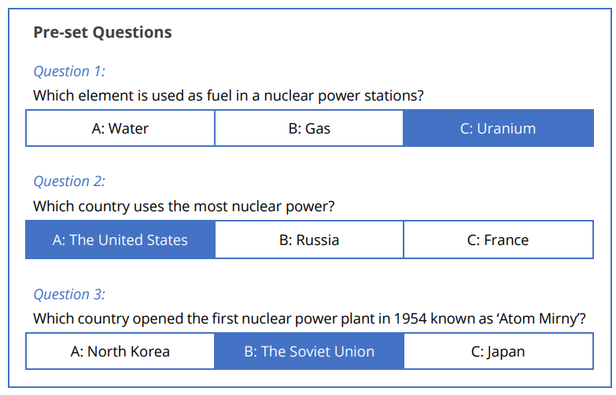

# Code.Sprint 2018

## Task 2 - Nuclear Power Plant Access Area 

<div align="center">
  
</div>
A scientist can access the Nuclear Powerplant lab by going through a three-tiered validation protocol as in the diagram below: 
<div align="center">
  
</div>

## Step 1: Addition:

The scientist must answer correctly a randomly generated addition problem with two numbers.

The values to be randomised are between 0 and 9; e.g. 3+7=? where 3 and 7 are randomly generated.

## Step 2: Question
The scientist must answer correctly a multiple-choice-answer question which is randomised from a list of three pre-set questions. The pre-set questions & answers are listed below; the correct answers are enclosed in a blue box
<div align="center">
  
</div>

## Step 3: PIN Code
The scientist must enter a four-numbered PIN Code which is the constant value 6502

## Log-In Access Flow
From one validation step to another the program will not provide any feedback to the scientist. At the end of the validation process, the scientist will be granted or denied access to the lab by displaying a message accordingly.

## Hint:
To ignore case sensitivity of the user’s answer (char) of the question displayed, the user input can be changed into its uppercase equivalent. For example, if the user enters character ‘b’, it can be changed to character ‘B’.

## Example of working program:

### Example 1:
```
3+7=?
11
Which element is used as fuel in a nuclear power stations?
A:Water
B:Gas
C:Uranium
C
Enter PIN:
6502
Access granted
``` 
### Example 2:
```
5+3=?
8
Which country uses the most nuclear power?
A:The United States
B:Russia
C:France
C
Enter PIN:
6501
Access denied
```
